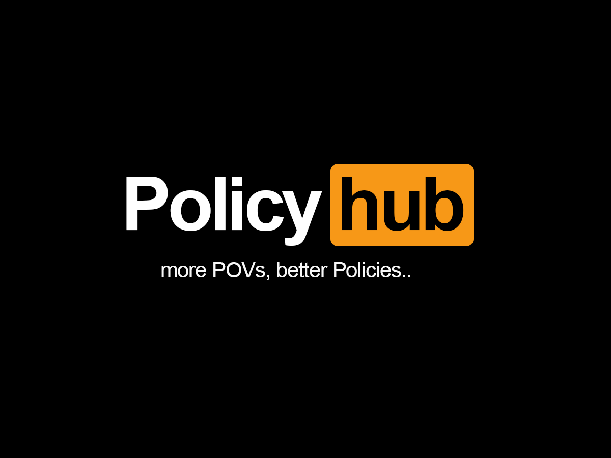

> "Good government depends on having good laws, good laws depend on having good ideas, good ideas survive collective scrutiny."
>
> — Montesquieu

  <iframe style="width: 100%;" src="https://drive.google.com/file/d/1TWu2KnJ2Rbn__0UDd_zCsdT7K6tZ6XXA/preview" width="640" height="480" allow="autoplay"></iframe>

Note: Embedded video dari google drive sehingga butuh waktu lebih lama untuk loading.

### Abstrak

Policy hub (collaborative policy making) adalah sistem informasi yang membuka rangkaian proses pembuatan/perumusan kebijakan kepada unit pelaksana kebijakan dan (mungkin) penerima kebijakan itu sendiri (publik). Proses ini bertujuan untuk memperluas ruang berfikir perumus kebijakan dengan cara memaksimalkan keikutsertaan stakeholders yang bertautan dengan lingkup suatu kebijakan yang telah ada maupun yang sedang dalam proses perumusan.

### Permasalahan

Disaat terdapat kebijakan yang tidak ideal, para pembuat kebijakan kerap menunjukkan kebiasaan buruk menutup telinga dan mata terhadap keluhan masyarakat bahkan terhadap lingkungan internal sendiri yaitu eksekutor/pelaksana kebijakan di lapangan, terkadang keluhan-keluhan ini juga hanya dijawab dengan bahasa normatif yang abstrak, tidak bermakna dan tidak memiliki tindaklanjut nyata dalam bentuk apapun. Hal ini disebabkan karena tidak adanya sistem yang memastikan para pembuat kebijakan ini untuk bekerja secara transparan dan akuntabel dalam menghasilkan dan mengevaluasi produk hasil kerja mereka sendiri kepada para pemanfaatnya.

### Solusi yang ditawarkan

Diperlukan perubahan paradigma pengelolaan kebijakan agar lebih elastis dan aksesibel. Policy hub memastikan input dari unit pelaksana terhadap permasalahan yang ditemukan di kebijakan yang ada maupun pada draft kebijakan yang akan datang, dikelola secara transparan dan akuntabel oleh pejabat pengelola kebijakan, proses perumusan menjadi lebih efisien dengan disediakannya outlet agar feedback dapat diberikan dan dievaluasi secara terbuka pada tiap tahap perumusan/perubahan kebijakan. Di sisi lain, dengan adanya proses penyempurnaan berkala yang berlangsung secara real-time pada draft kebijakan saat perumusan, unit pelaksana yang mengakses dapat berpartisipasi secara langsung dan menerima kemudahan dalam memahami alur / dasar pemikiran melalui dokumentasi pembuatan kebijakan sehingga setelah kebijakan berlaku, kegiatan sosialisasi kebijakan ke unit-unit pelaksana dapat diminimalisir. Teknis penerapan sistem Policy hub dapat dilihat pada link tertaut.

tldraw: [click to open workflow](https://www.tldraw.com/ro/kZSL6lEbdYc6zVtze2HYc?d=v-1214.-541.6624.2998.page)
